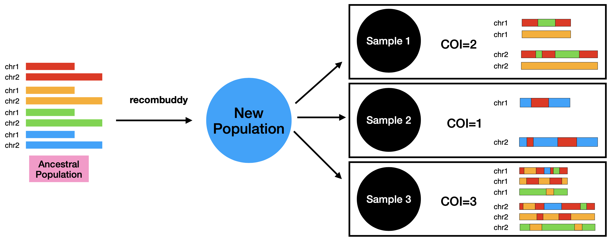

# Overview 

In addition to reviewing the available analysis tools, we have benchmarked several tools by creating several simulated populations with a focus on tools that work with allele/amplicon/microhaplotype calls. 

The following tools have been benchmarked on amplicon data [simulations](#simulations). 

* [Complexity of infection(COI)](benchmarking_COI_tools.qmd) estimators
    * naive COI estimator (taking a max/percentile of COI)
    * MOIRE
    * TheREALMcCOIL
    * COIAF
* single locus variant freq
    * naive single locus freq
    * IDM
* single locus microhaplotype freq
    * MOIRE
* multi-locus variant freq
    * naive multi locus freq estimator
    * FreqEstimationModel
    * MLBM
* multi-locus microhaplotype freq
    * malariaem
    

# Simulation framework 

In order to robustly benchmark the above tools, we created several different populations with various characteristics for between sample relatedness, complexity of infection (COI), and different geographic backgrounds. These simulations create raw fastq files that are then run through amplicon calling pipelines and then the tools themselves to emulate real world analysis.  

## Simulating Populations 

In order to create populations with various characteristics to benchmark we created a simulation framework. The first part of this simulation is creating new populations by simulating recombination from an original ancestor population. This allows to incorporate real genomic data from any original population and then create a new population with desired characteristics (between-sample relatedness, average COI, etc). We have accomplished this by creating an R package (under development) called [recombuddy](https://github.com/PlasmoGenEpi/recombuddy). This packages takes a list of ancestors (samples with known genotyping data) and create a new population of mosaic genomes (e.g. strain 1 with chr1 pos 0-1000 from ancestor 1, pos 1001-2500 ancestor 2, etc) which can then be intersected with the original genotyping data to create a new strain with known genotypes phased across the whole genome. This package requires just a list of ancestors and chromosome(s) size(s) so any haploid genome can be simulated. 

## Simulating PCR/sequencing error  

The above simulated populations can then be intersected with any known genotyping data known for the ancestor population which can be a targeted amplicon panel. The new samples with known strain genotypes are then simulated for PCR amplification (with setting for starting template amount, number of PCR rounds, degree of chimera formation, taq error rate) and sequencing is simulated by using an empirically derived error profile from real sequencing data. 

# Benchmark simulations 

Using the above framework we simulated 240 populations by combining the following characteristics: 

*  Population characteristics (each combination done replicate 10 times with 100 samples each)
    *  Ancestral population 
        *  Ghana (sourced from 2011 Pf7[@MalariaGEN2023-wz] data)
        *  Cambodia (sourced from 2011 Pf7[@MalariaGEN2023-wz] data)
    *  Between-sample relatedness 
        *  30%
        *  10%
        *  1% 
    *  COI
        *  Population Mean COI of 1.256 with 80% of samples being monoclonal 
        *  Population Mean COI of 3.620 with 32% of samples being monoclonal 
    *  Recombination rate 
        *  50% non-recombinant 
        *  20% non-recombinant 
*  PCR/Sequencing 
    *  SpotMalaria[@Jacob2021-ib] panel 
    *  30 rounds of PCR
    *  2x150 NextSeq 
    *  Mean parasite densities with a mean of ~2500 parasites/ul ranging from 10 to 6,000
    *  ~ 500 reads per loci 

