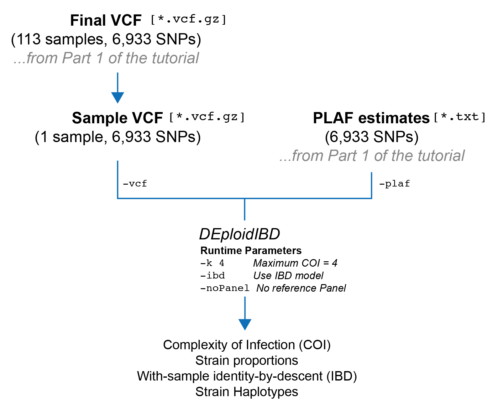

## Part 2: Reference-panel free deconvolution with `DEploidIBD`

#### Overview
In this section, we are going to run `DEploidIBD` on a single sample without using a reference panel. After this is completed, `DEploidIBD` will have produced an estimate of the complexity of infection (COI), the proportions of each strain, and IBD profiles for every pair of strains within the sample. Finally, we will go over the output files and what they contain.

Here is a schematic of what we will do:
<p align="center"></p>

#### Prerequisites
Please ensure you have completed both 'Installation' and 'Part 1' of the tutorial. At this point, you should have:
- Installed `DEploidIBD`
- Installed `bcftools`
- Filtered your input VCF
- Created a text file containing population level allele frequency (PLAF) estimates for each SNP from your filtered VCF

Your directory structure should look like:
```
.
├── data -> /path/to/PGEforge/data
├── data_filtered
│   ├── intermediates
│   ├── pf3k.DRCongo.final.plaf.txt
│   └── pf3k.DRCongo.final.vcf.gz
├── results
```

#### Running DEploidIBD for an individual sample

**Selecting a sample**

`DEploidIBD` runs on only one sample from a population at a time. This means we need to subset our input VCF down to an individual sample of interest. Let's first create a folder where we will store  per-sample VCFs:

```
mkdir -p data_filtered/by_sample
```

Next, we will use `bcftools` to filter our VCF to an individual sample. Here, I have chosen the sample QG0182-C, which is simply the first sample in the metadata file located at `PGEforge/data/wgs/pf3k/DRCongo/pf3k.metadata.DRCongo.csv`. Let's define some commands in bash to make our code a bit cleaner:

```
TARGET_SAMPLE=QG0182-C
SAMPLE_VCF=data_filtered/by_sample/pf3k.DRCongo.$TARGET_SAMPLE.vcf.gz
```

Our input VCF should be the filtered VCF from the previous part of the tutorial:

```
INPUT_VCF=data_filtered/pf3k.DRCongo.final.vcf.gz
```

And now we can filter:

```
bcftools view $INPUT_VCF -s $TARGET_SAMPLE -Oz -o $SAMPLE_VCF
```

If we run:

```
bcftools stats $SAMPLE_VCF | grep ^SN
```

We should see that our VCF contains only a single sample, and the same number of records as our filtered VCF:

```
SN      0       number of samples:      1
SN      0       number of records:      6933
SN      0       number of no-ALTs:      0
SN      0       number of SNPs: 6933
SN      0       number of MNPs: 0
SN      0       number of indels:       0
SN      0       number of others:       0
SN      0       number of multiallelic sites:   0
SN      0       number of multiallelic SNP sites:       0
```


**Running `DEploidIBD`**

Let's create an output folder to store the results from `DEploidIBD`:

```
RESULT_DIR=results/$TARGET_SAMPLE
mkdir -p $RESULT_DIR
```

Finally, it is time to run `DEploidIBD`

```
dEploid -vcf $SAMPLE_VCF -plaf $PLAF_TXT -o $RESULT_DIR/$TARGET_SAMPLE -k 4 -noPanel -ibd
```

Here is a table explaining the flags we've used:

| Flag      | Meaning   |
|-          |-          |
| `-vcf`    | Path to input VCF file. |
| `-plaf`   | Path to PLAF text file. See Part 1 of the tutorial for details |
| `-k`      | The *maximum* COI that will be inferred. The default value is 5, but in practice 4 is probably the limit for WGS data. |
| `-noPanel` | Do *not* use a reference panel for haplotype inference. |
| `-ibd`    | Run the IBD model, e.g. `DEploidIBD`. In this model we handle within-sample IBD |

With these flags, `DEploidIBD` should take a few minutes to run on a laptop and print some basic information to the screen. Let's have a look:

```
#########################################
#        dEploid v0.7.1-beta log        #
#########################################
Program was compiled on: Mon-11-Dec-2023-17:23:28-UTC
dEploid version: 47533f7526ed8f7b615750969e9b008054bdc7fc
lasso version: 

Input data: 
      PLAF: data_filtered/pf3k.DRCongo.final.plaf.txt
       VCF: data_filtered/by_sample/pf3k.DRCongo.QG0182-C.vcf.gz

MCMC parameters: 
        MCMC burn: 0.5
      MCMC sample: 800
 MCMC sample rate: 5
      Random seed: 0
  IBD Method used: YES
      Update Prop: NO
    Update Single: YES
      Update Pair: YES

Other parameters:
    Miss copy prob: 0.01
  Avrg Cent Morgan: 15000
                 G: 20
         IBD sigma: 20
     ScalingFactor: 100
     VQSLOD:        8
      Initial prob: 0.00194298 0.895357 7.5923e-16 0.1027

MCMC diagnostic:
     Accept_ratio: 0
         Max_llks: -11603.3
 Final_theta_llks: -8827.36
        Mean_llks: -8967.05
        Stdv_llks: 25.5135
    DIC_by_Dtheta: 18213.5
      DIC_by_varD: 19236

Run time:
    Start at: Wed Dec 13 16:02:39 2023
      End at: Wed Dec 13 16:08:18 2023

Output saved to:
 IBD method output saved to:
  Likelihood: results/QG0182-C/QG0182-C.*.llk
 Proportions: results/QG0182-C/QG0182-C.*.prop
  Haplotypes: results/QG0182-C/QG0182-C.*.hap
   IBD probs: results/QG0182-C/QG0182-C.ibd.probs

 IBD probabilities:
           0-1: 0.740756
           1-1: 0.259244

 IBD best path llk: 8192.76

         Effective_K: 1.2312
          Inferred_K: 2
Adjusted_effective_K: 1.2312

Proportions:
0.00194298	  0.895357	7.5923e-16	    0.1027
```

The most critical estimates are at the bottom. We can see that `DEploidIBD` has inferred a COI, here denoted $K$, of two:

```
          Inferred_K: 2
```

It also reports another statistic, called the "Effective COI" ($K_{eff}$), with this sample having $K_{eff}=1.231$. 

```
         Effective_K: 1.2312
          Inferred_K: 2
```

Effective COI has the following definition:

$$
K_{eff} = \frac{1}{\sum_{j=1}^{K} p_{j}^2}
$$

As you can see, this statistic takes into account the proportions of the strains in the infection and produces a continuous-valued statistic rather than an interger, as is the case with COI. In particular, $K_{eff}$ will be in the range of $[1, K]$. If the strains in the infection have balanced proportions, the $K_{eff}$ value will be close to $K$. On the other hand, if strains within the infection have very low proportions, these will contribute only marginally to the $K_{eff}$, and as a result it can be considerably lower than the COI ($K$). In our case we can see the inferred proportions are:

```
Proportions:
0.00194298	  0.895357	7.5923e-16	    0.1027
```

The two proportions below 0.01 are discard, so the proportions of our strains of interest are 0.89 and 0.1. This examples why our $K_{eff}=1.231$ value is quite low: these proportions are relatively unbalanced.

If we look in the metadata file at `data/wgs/pf3k/DRCongo/pf3k.metadata.DRCongo.csv` we can see that sample QG0182-C has a $F_{ws}$ value of 0.843. Canonically, as sample with $F_{ws} < 0.95$ is classified as polyclonal. So the inference from `DEploidIBD` of a $K=2$ is consistent with the $F_{ws}$ statistic for this sample.


