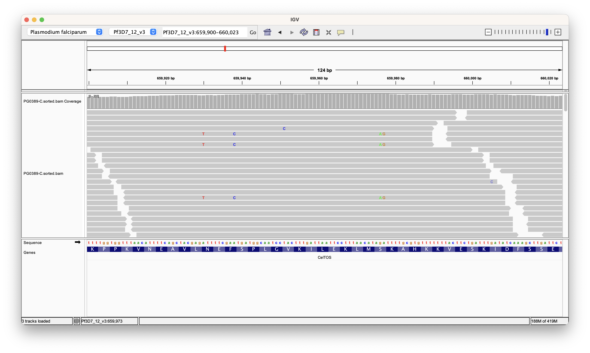

```{r setup, include=FALSE}
knitr::opts_chunk$set(echo = TRUE)
library(kableExtra)
```

## The data

To perform the analysis estMOI requires:

* A bam file which should be sorted
* A vcf file which can either be zipped or unzipped
* The reference genome

For the purpose of hosting the data we have provided bam and vcf files containing data for the 
_csp_, _celtos_ and _ama1_ genes. You can find these files 
[here](https://github.com/mrc-ide/PGEforge/tree/main/data).

We now need to download the reference genome. You can download this from plasmodb by clicking on 
[this link](https://plasmodb.org/common/downloads/release-66/Pfalciparum3D7/fasta/data/PlasmoDB-66_Pfalciparum3D7_Genome.fasta)

## Running the tool

Let's use run the analysis for the sample PG0402-C which is sample with a known MOI > 1. Let's 

Before we can run estMOI we need to index the reference genome. This can by done with

``` bash
samtools faidx PlasmoDB-66_Pfalciparum3D7_Genome.fasta
```

Now let's run the pipeline with default parameters. The three positional arguments should be:

1. The bam file 
2. The VCF file
3. The reference genome

You can also customise the output file prefix with `--out`

``` bash
estMOI PG0402-C.sorted.bam PG0402-C.vcf PlasmoDB-66_Pfalciparum3D7_Genome.fasta --out PG0402-C
```

After running it will print a summary of the analysis to the terminal and you should see the output below:

``` bash
#	RUNNING estMOI version 1.03
#	................
#	PRINT ESTIMATES...
#	MOI	Count	%Total
#	1	319	66.88
#	2	158	100.00	MOI-estimate
	#DONE MOI-estimate using PG0402-C.sorted.bam
```

### Output description

Running estMOI will produce two output files with the prefix that you specified before.
Additionally, the values of the `--maxsnp`, `--mindis`, `--maxdis` and `--minhap` parameters will also 
be present in the output file names.

For example, you should have the files PG0402-C.moi.3.10.500.3.log and PG0402-C.moi.3.10.500.3.txt 
in your directory. 


#### Log file

The file ending in .log contains the individual combinations of all haplotypes that were found.
For each haplotype it will give you the locations of the SNPs together with the individual haplotype 
combinations. For example, here is an excerpt form the log file that contains this information for one 
haplotype:

``` bash
PG0402-C.sorted.bam	Pf3D7_03_v3	221435 221457 221554	2
	# PG0402-C.sorted.bam Pf3D7_03_v3 221435 221457 221554 Hapotype:	 T A C	48
	# PG0402-C.sorted.bam Pf3D7_03_v3 221435 221457 221554 Hapotype:	 T G C	10
```

#### Txt file

The result file will contain the the same information as printed to the terminal.
It lists the numbers of haplotypes and for each MOI and provides an estimate of the MOI.
The the example below there are 319 locus with a single haplotypes and 158 with two haplotypes.

``` bash
#MOI	Count	%Total
1	319	66.88
2	158	100.00	MOI-estimate
```

## Refining the results

Let's run this on another sample:

``` bash
estMOI PG0389-C.sorted.bam PG0389-C.vcf  PlasmoDB-66_Pfalciparum3D7_Genome.fasta --out PG0389-C
```

You should see that no MOI has been estimates:

``` bash
#	RUNNING estMOI version 1.03
#	................
#	PRINT ESTIMATES...
#	MOI	Count	%Total
	#DONE MOI-estimate using PG0389-C.sorted.bam
```

To troubleshoot it is a good idea to look at the log. Run the following to find information about the 
haplotypes that have been analysed: 

``` bash
cat  PG0389-C.moi.3.10.500.3.log
```

You should see no output, indicating that no haplotypes were analysed and explains why there was no 
MOI estimate produced. estMOI loads the variant locations from the VCF and looks at combinations of 
those in the reads using the bam files. 

Looking at the bam file it is clear that there are some variant haplotypes present. 



Next thing to do is to check that we actually have variants in the VCF. You can do this with:

``` bash
less PG0389-C.vcf
```

You should be able to see that there are many variant positions, however you might notice that the quality 
values are very low. estMOI has a hard-coded cutoff for the quality value and only analyses variants with 
quality values greater or equal to 30. This may explain why the estMOI didn't analyse any haplotype positions.

The VCFs were created with freebayes using a diploid model and low frequency variants are assigned low 
quality values. We can use a different variant caller, lofreq, that is more suited to low frequency variants which 
will hopefully assign higher quality values to these variants. First let's install lofreq:

``` bash
mamba install -y -c conda-forge -c bioconda lofreq
```

Now we can use lofreq to call variants from the bam:

``` bash
lofreq call -f PlasmoDB-66_Pfalciparum3D7_Genome.fasta PG0389-C.sorted.bam > PG0389-C.lofreq.vcf
```

Now we are ready to call run estMOI again using the new vcf you created:

``` bash
estMOI PG0389-C.sorted.bam PG0389-C.lofreq.vcf  PlasmoDB-66_Pfalciparum3D7_Genome.fasta  --out PG0389-C
```

You shold hopefully see an MOI estimate of 2 now after the tools finishes running:

``` bash
#	RUNNING estMOI version 1.03
#	................
#	PRINT ESTIMATES...
#	MOI	Count	%Total
#	1	98	68.06
#	2	46	100.00	MOI-estimate
	#DONE MOI-estimate using PG0389-C.sorted.bam
```

## Summary

To summarise, we can use estMOI to estimate MOI using the read data stored in bams and variants stored 
in VCF format. The variants filtered by the pipeline based on a quality value so make sure you are happy
with the variants your VCF before proceeding with the analysis.