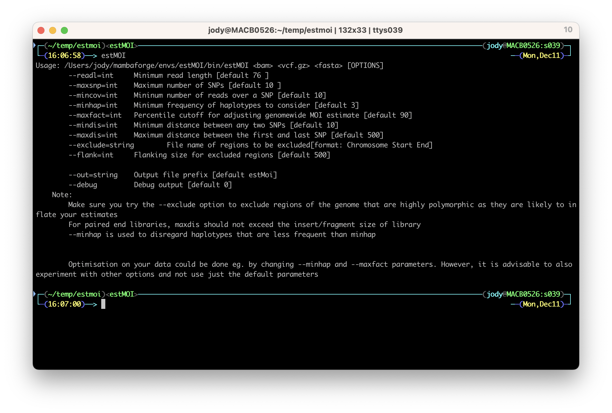

```{r setup, include=FALSE}
knitr::opts_chunk$set(echo = TRUE)
```


## Step 1: Installing conda

EstMOI is written in perl. It also requires [samtools](http://www.htslib.org/) at runtime.
To help us install these tools we'll use [mamba](https://github.com/conda-forge/miniforge). 
If you already have conda installed then you can skip to step 2.

Head over to the [mambaforge github page](https://github.com/conda-forge/miniforge) and follow the install instructions. Remember to use 
the relevant install script for your operating system.

## Step 2: Install dependancies

Once you have conda/mamba set up you can start insalling the dependancies. You can do this with

``` bash
mamba create -y -c conda-forge -c bioconda -n estMOI perl curl "samtools>=1.12"
```

This will create an environment called `estMOI` that you can activate with

``` bash
conda activate estMOI
```

## Step 3: Install estMOI

Finally we can install the script into your path and make it executable with 

``` bash
curl https://raw.githubusercontent.com/sammy-assefa/estMOI/master/estMOI_1.03 > $CONDA_PREFIX/bin/estMOI
chmod 755 $CONDA_PREFIX/bin/estMOI
```

Run `estMOI` in your terminal and see if it runs. You should get an output showing an 
explanation of all the parameters.

